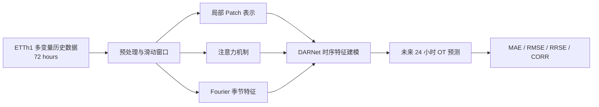
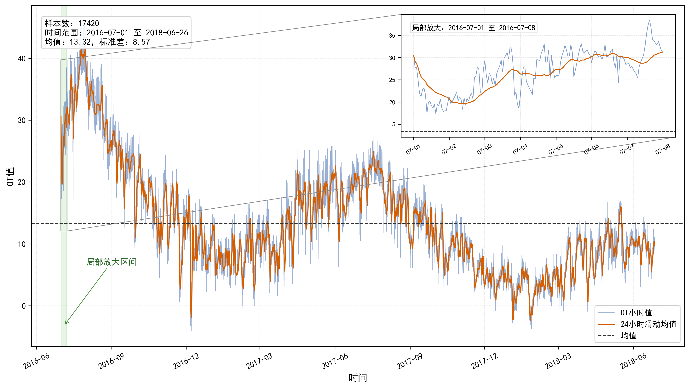
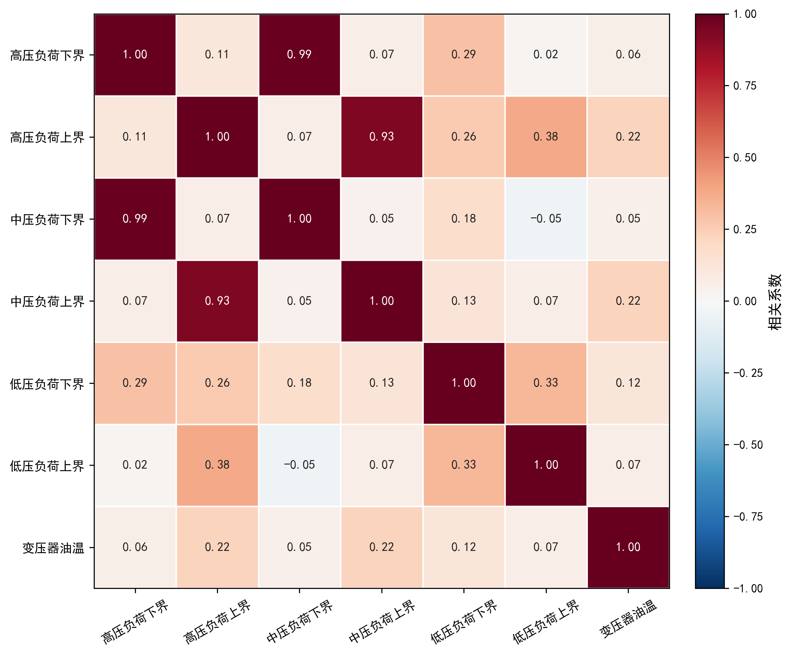

<div align="center">

# DARNet-ETTh1

### 面向变压器油温的短期多变量时间序列预测

[](https://www.python.org/)
[](https://pytorch.org/)
[](https://github.com/zhouhaoyi/ETDataset)
[](LICENSE)
[](#项目简介)

利用过去 **72 小时**的多变量观测，预测未来 **24 小时**的变压器油温 `OT`。

[项目简介](#项目简介) · [模型方法](#方法概览) · [实验结果](#实验结果) · [快速开始](#快速开始) · [核心代码](#核心代码说明) · [Model Card](docs/MODEL_CARD.md)

</div>

---

## 项目简介

DARNet-ETTh1 是一个面向短期多变量时间序列预测的本科毕业设计项目。项目以 ETTh1 数据集中的变压器油温 `OT` 为预测目标，在 DARNet 基础框架上研究局部 **Patch 表示**、**注意力机制**与 **Fourier 季节性特征**对预测性能的影响。

仓库包含可复现训练代码、六组消融实验、预训练权重、实验结果、论文图表和交互式数据分析 Notebook。无需重新训练即可查看论文采用的实验数据，也可以直接加载权重进行评估。

## 实验概览

| 项目 | 配置 |
|---|---|
| 研究任务 | 多变量时间序列到多步连续值预测 |
| 输入 / 输出 | 72 小时历史观测 → 未来 24 小时 `OT` |
| 数据规模 | ETTh1，17,420 条小时级记录，7 个数值变量 |
| 消融设计 | 6 种统一模式，分别评估 Patch、Attention 与季节特征 |
| 最佳结果 | Patch：RMSE `13.0248`，相比 Baseline 下降 `5.49%` |
| 可复现材料 | 训练源码、环境配置、预训练权重、原始 CSV、Notebook 与绘图脚本 |

## DARNet 的原始用途

本项目参考的 DARNet 最初并不是电力预测模型。原论文 **DARNet: Dual Attention Refinement Network with Spatiotemporal Construction for Auditory Attention Detection** 发表于 NeurIPS 2024，用于**听觉注意检测（Auditory Attention Detection, AAD）**：模型分析 EEG 脑电信号，判断受试者在多人说话环境中正在关注哪一位说话者。

原始 DARNet 由三个主要部分组成：

1. **Spatiotemporal Construction Module**：通过时间卷积和空间卷积构造 EEG 时空特征。
2. **Dual Attention Refinement Module**：使用双层自注意力与细化结构捕获多层时间模式和长距离依赖。
3. **Feature Fusion & Classifier Module**：融合浅层与深层特征，完成听觉注意分类。

本项目将其时序特征提取和长距离依赖建模思想迁移到 ETTh1 连续值预测任务，并围绕 Patch、Attention 和 Fourier 季节特征开展消融实验。任务由原论文的 EEG 分类转变为：根据 72 小时多变量观测，回归预测未来 24 小时的变压器油温。

- [仓库内参考论文 PDF](references/DARNet_Auditory_Attention_Detection_NeurIPS2024.pdf)
- [原论文 arXiv 页面](https://arxiv.org/abs/2410.11181)
- [原作者 DARNet 代码](https://github.com/fchest/DARNet)

## 主要功能

- ETTh1 多变量数据读取、时间排序、归一化与滑动窗口构造。
- 以 72 小时历史序列预测未来 24 小时 `OT`。
- 支持 Baseline、Patch、Attention、Patch + Attention、Season 和 Full Model 六种模式。
- 支持训练、权重保存、预训练模型评估与实验结果自动汇总。
- 提供数据趋势、特征相关性和消融实验结果可视化。
- 提供 Notebook，用于快速探索数据和复核论文实验结论。

## 方法概览



项目通过开关不同模块构成统一消融实验：

| 模式 | Patch | Attention | 季节特征 | 说明 |
|---|:---:|:---:|:---:|---|
| `baseline` | — | — | — | DARNet 基础对照模式 |
| `patch` | ✓ | — | — | 使用长度为 4 的局部时间片段 |
| `attention` | — | ✓ | — | 加入注意力机制 |
| `patch_attention` | ✓ | ✓ | — | 联合 Patch 与注意力 |
| `season` | — | — | ✓ | 加入 Fourier 周期特征 |
| `full_model` | ✓ | ✓ | ✓ | 同时启用三个组件 |

## 实验结果

以下结果来自相同实验设置下的六模式对比，RMSE 越低越好：

| 模式 | MAE | RMSE | RRSE | CORR |
|---|---:|---:|---:|---:|
| Baseline | 12.8327 | 13.7816 | 4.0558 | -0.0073 |
| **Patch** | **11.5504** | **13.0248** | **3.8331** | 0.0153 |
| Attention | 12.6052 | 13.6612 | 4.0204 | **0.0770** |
| Patch + Attention | 11.5505 | 13.0248 | 3.8331 | 0.0153 |
| Season | 11.5507 | 13.0249 | 3.8331 | 0.0153 |
| Full Model | 12.7341 | 13.6427 | 4.0149 | -0.0449 |

在当前配置下，Patch 模式取得最佳 RMSE，相比 Baseline 下降约 **5.49%**。结果表明局部片段表示对该任务有效；其他模块的组合效果仍受到参数配置和训练策略影响，值得进一步研究。

<details>
<summary><strong>查看更多数据分析图</strong></summary>

### OT 时间序列趋势



### 多变量特征相关性



</details>

## 快速开始

### 1. 安装环境

建议使用 Python 3.10：

```bash
python -m pip install -r requirements.txt
```

也可以使用 Conda：

```bash
conda env create -f environment.yml
conda activate darnet-etth1
```

### 2. 查看已有结果

论文参考结果位于：

```text
results/all_modes_summary.csv
```

也可以运行 `notebooks/01_dataset_exploration.ipynb` 和 `notebooks/02_ablation_analysis.ipynb`，交互式查看数据及消融实验。

### 3. 评估预训练模型

评估已有权重，不会重新训练模型：

```bash
python code/evaluate_checkpoint.py patch
```

可选模式：`baseline`、`patch`、`attention`、`patch_attention`、`season`、`full_model`。

### 4. 运行训练实验

运行一个模式：

```bash
python code/run_all_modes.py --mode patch --seed 42
```

依次运行全部六种模式：

```bash
python code/run_all_modes.py --mode all --seed 42
```

新实验会写入带时间戳的 `outputs/run_*` 目录，不会覆盖归档结果。

## 核心代码说明

| 路径 | 具体作用 | 是否主要入口 |
|---|---|:---:|
| `code/0114-DARNet-V4-opt.py` | 定义数据处理、DARNet 网络结构、Patch/Attention/季节特征开关、训练循环、验证与指标计算，是论文实验的核心实现 | 核心源码 |
| `code/run_all_modes.py` | 统一配置六种消融模式，调用核心源码训练，分别保存权重和 CSV，并生成汇总结果 | 推荐训练入口 |
| `code/evaluate_checkpoint.py` | 加载 `pretrained/` 中的已有权重，在测试集上重新计算指标，不执行训练 | 推荐评估入口 |
| `code/generate_etth1_figures.py` | 读取 ETTh1，生成目标变量时间趋势图和多变量相关性热力图 | 数据绘图 |
| `code/plot_ablation_rmse.py` | 读取六模式汇总 CSV，生成 DARNet 消融实验 RMSE 对比图 | 结果绘图 |
| `notebooks/01_dataset_exploration.ipynb` | 交互式查看数据统计、OT 趋势和特征相关性 | 快速体验 |
| `notebooks/02_ablation_analysis.ipynb` | 交互式比较六种模式，并自动计算最佳模型和相对改善比例 | 快速体验 |
| `supplementary/0114-DARNet-V4-finaltry.py` | 保存后续补充优化实验，不替代正式六模式训练源码 | 补充材料 |

如果只想复现实验，优先使用 `run_all_modes.py`；如果只想验证现有结果，使用 `evaluate_checkpoint.py`；`0114-DARNet-V4-opt.py` 负责主要模型和训练逻辑，一般不需要直接修改。

## 项目结构

```text
DARNet-ETTh1/
├── README.md                       # GitHub 项目主页
├── LICENSE                         # 项目代码 MIT 许可证
├── THIRD_PARTY_NOTICES.md          # 数据集和论文的第三方声明
├── requirements.txt               # pip 依赖
├── environment.yml                # Conda 环境
├── docs/                           # Model Card 等研究说明
├── code/
│   ├── 0114-DARNet-V4-opt.py       # 正式训练源码
│   ├── run_all_modes.py            # 六模式运行入口
│   ├── evaluate_checkpoint.py      # 预训练权重评估
│   └── generate_etth1_figures.py   # 绘图脚本
├── notebooks/                      # 数据与实验交互分析
├── data/                           # ETTh1 数据与说明
├── pretrained/                     # 六种模式预训练权重
├── results/                        # 论文参考实验结果
├── figures/                        # 论文图表
├── references/                     # DARNet 原始论文参考资料
├── supplementary/                  # 补充优化实验与历史源码
└── outputs/                         # 新运行结果说明
```

## 数据集

ETTh1 包含 17,420 条逐小时记录，字段包括 `HUFL`、`HULL`、`MUFL`、`MULL`、`LUFL`、`LULL` 和目标变量 `OT`。本项目按时间顺序划分数据，归一化器只在训练部分拟合，避免测试信息泄漏。

数据来自 [zhouhaoyi/ETDataset](https://github.com/zhouhaoyi/ETDataset) 中的 `ETT-small/ETTh1.csv`。仓库内文件与原始数据的 MD5 一致，按原项目的 CC BY-ND 4.0 许可证保留并署名；具体说明见 `data/数据集说明.md` 和 `THIRD_PARTY_NOTICES.md`。

## 后续计划

- [ ] 支持 48、96、168 等更多预测长度。
- [ ] 在 ETTm1、ETTm2、Electricity 和 Weather 等数据集上验证泛化性能。
- [ ] 研究多尺度或自适应 Patch，而非固定长度 Patch。
- [ ] 引入趋势—周期分解和更高效的稀疏注意力机制。
- [ ] 加入预测区间和不确定性估计。
- [ ] 增加 YAML 配置、自动调参与实验跟踪。
- [ ] 与 PatchTST、Informer、Autoformer 等模型进行统一对比。
- [ ] 构建 Streamlit/Gradio 在线预测与可视化演示。

## 说明

本仓库用于毕业论文实验复现与学术交流。不同硬件、CUDA、PyTorch 版本可能产生少量浮点差异，论文结果以 `results/` 中归档文件为准。

## 许可证

本项目自行编写的代码与文档采用 [MIT License](LICENSE)。`data/ETTh1.csv` 采用原始 ETDataset 的 [CC BY-ND 4.0](https://creativecommons.org/licenses/by-nd/4.0/) 许可证；参考论文 PDF 的版权归原作者及出版方所有。第三方材料不属于 MIT License 的授权范围，详见 [THIRD_PARTY_NOTICES.md](THIRD_PARTY_NOTICES.md)。
